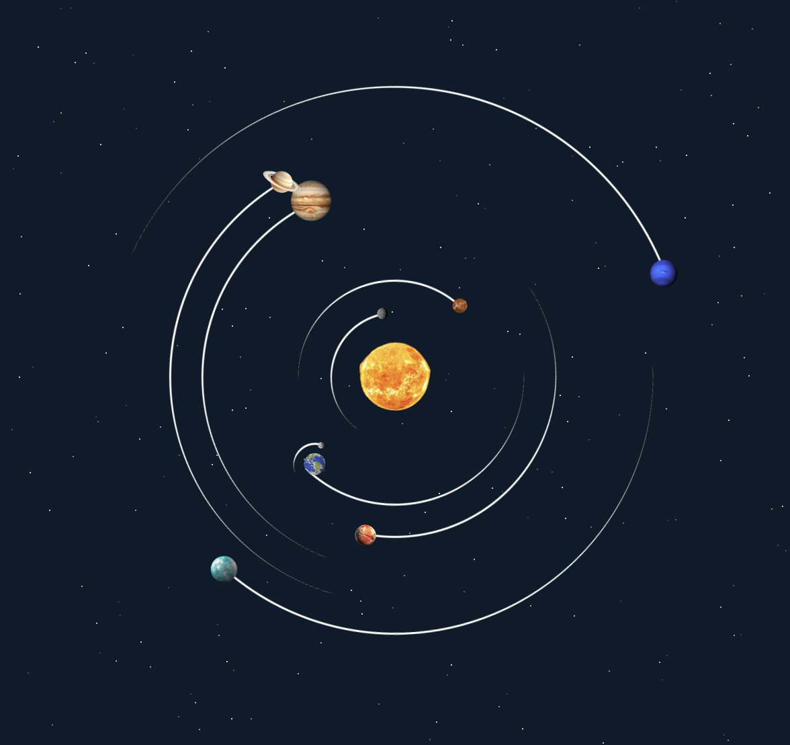

# Solar System Simulation with CSS

This project is a simple simulation of the solar system using CSS animations. It displays the planets orbiting around the sun and the moon orbiting around the Earth.



## Table of Contents
- [Features](#features)
- [Installation](#installation)
- [Usage](#usage)
- [Build](#build)
- [License](#license)

## Features
- Realistic simulation of the solar system.
- Smooth CSS animations for planet orbits.
- Moon orbiting around the Earth.
- Lightweight and easy to understand codebase.

## Installation
1. Clone this repository to your local machine:
   ```bash
   git clone https://github.com/barrymun/solar-system.git
   ```
2. `cd` into the project directory.

## Usage
- Execute `bun run docker-dev-up` to get the project working locally with docker.

## Build
- Execute `bun run build`.

## License
This project is licensed under the MIT License - see the [LICENSE](LICENSE) file for details.
